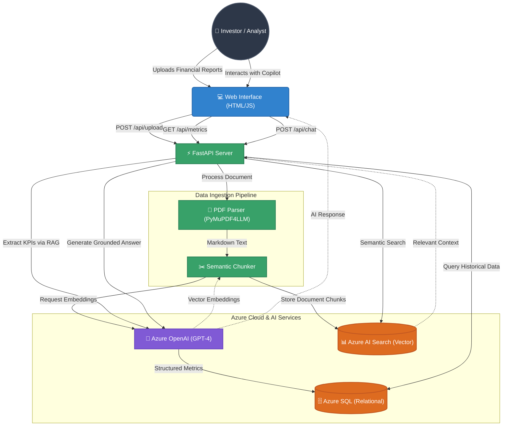
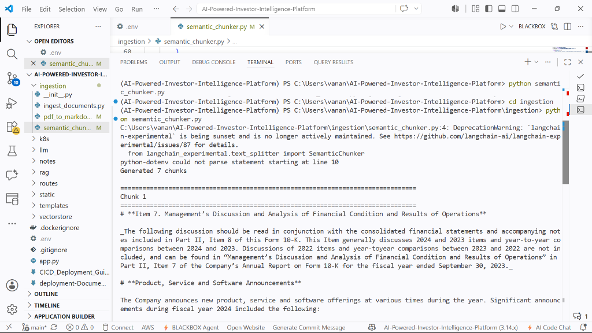
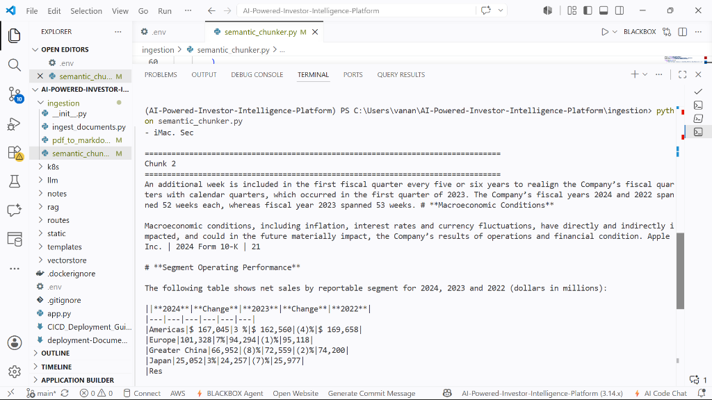
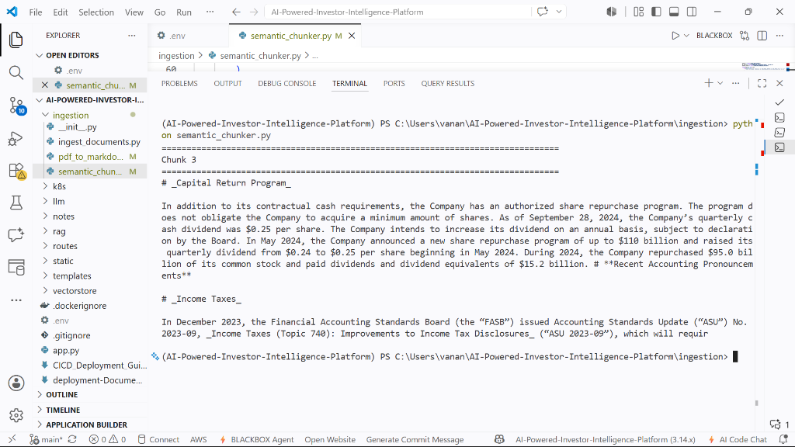
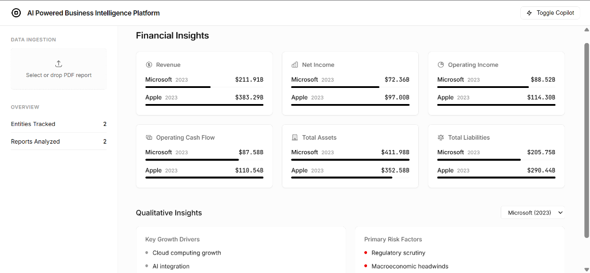
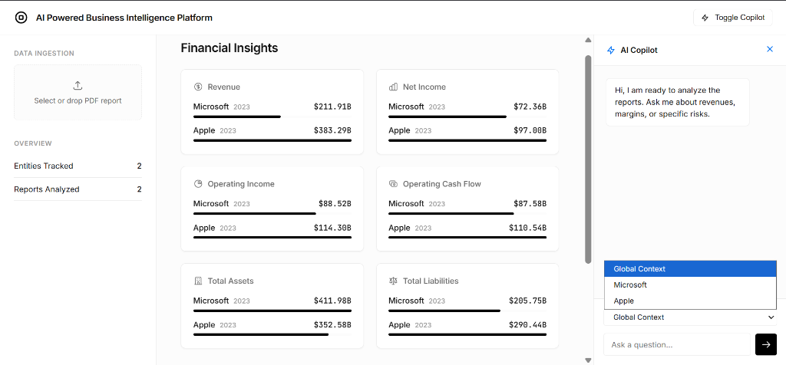

# AI Bussiness Intelligent Platform

## Overview

AI Bussiness Intelligent Platform is an enterprise-grade AI-powered financial intelligence platform designed to automate the ingestion, analysis, and querying of dense financial reports (such as 10-K and 10-Q filings). By leveraging Large Language Models (LLMs) and Retrieval-Augmented Generation (RAG), the platform instantly extracts critical Key Performance Indicators (KPIs) and provides an interactive AI Copilot for qualitative financial research, transforming unstructured documents into structured, actionable insights for investors and financial analysts.

## Problem Statement

Financial analysts and investors spend countless hours manually parsing hundreds of pages of complex, unstructured corporate filings to extract essential metrics (Revenue, Operating Margin, Debt) and qualitative insights (Risk Factors, Growth Drivers). 
* **Current Challenge:** The volume of financial data makes manual review slow, error-prone, and inefficient.
* **Limitations:** Critical insights are often buried deep in footnotes or lengthy management discussions, making them easy to miss.
* **Impact:** Without automated intelligence, investment teams suffer from delayed decision-making and reduced analytical coverage across portfolios.

## Existing System

Traditionally, financial analysis relies on:
* **Manual Data Entry:** Analysts manually copying data from PDFs into Excel models.
* **Keyword Searching (CTRL+F):** Inefficiently searching through massive documents for specific terms, missing semantic context.
* **Third-Party Data Providers:** Expensive terminal subscriptions that often lack the underlying qualitative context or real-time document interaction.
* **Limitations:** These methods are time-consuming, scale poorly across multiple companies, and disconnect quantitative metrics from the qualitative management commentary that explains them.

## Proposed System

This project introduces a fully automated pipeline that bridges the gap between unstructured documents and structured analytics:
* **Automated Data Processing:** Users upload PDF reports which are instantly converted into semantically chunked markdown.
* **AI Extraction:** Azure OpenAI is utilized to automatically pull exact financial KPIs and qualitative summaries, storing them in a relational database.
* **Semantic Search:** Document chunks are vectorized and stored in Azure AI Search.
* **Interactive AI Copilot:** A conversational interface allows users to ask complex financial questions, receiving answers grounded exclusively in the provided corporate filings via a secure RAG pipeline.

By moving from manual reading to AI-assisted extraction and retrieval, analysts can focus on strategic decision-making rather than data aggregation.

## Key Features

* **Automated Ingestion Pipeline:** Drag-and-drop PDF processing and parsing.
* **KPI Extraction:** Automated retrieval of Revenue, Net Income, Cash Flow, Assets, and Liabilities.
* **Qualitative Intelligence:** Automatic summarization of Key Growth Drivers and Primary Risk Factors.
* **Interactive RAG Copilot:** Context-aware chatbot for querying the exact contents of the financial reports.
* **Dynamic Dashboard:** Real-time visualization of extracted metrics and comparative entity tracking.
* **Cloud-Native Architecture:** Fully containerized and ready for Kubernetes (AKS) deployment.

## System Architecture

The following diagram illustrates the end-to-end data flow of the platform—from document ingestion and AI chunking to the real-time RAG-powered Copilot interface.



## Technology Stack

### Frontend
* HTML5, CSS3, Vanilla JavaScript
* Jinja2 Templating

### Backend
* Python 3.12
* FastAPI
* Uvicorn

### AI / ML
* Azure OpenAI (GPT-4, text-embedding-ada-002)
* LangChain (Semantic Chunking)
* PyMuPDF4LLM (PDF to Markdown)

### Database
* Azure PostgreSQL (Structured KPI storage)
* Azure AI Search (Vector database)

### Development & Deployment Tools
* Docker
* Azure Kubernetes Service (AKS)
* Azure Container Registry (ACR)
* UV Package Manager

## Project Structure

```text
project/
├── data/                  # Sample financial reports (Apple, Microsoft, Tesla)
├── database/              # PostgreSQL connection, table creation, and metric logic
├── ingestion/             # PDF-to-Markdown conversion and processing
├── llm/                   # Azure OpenAI client initialization
├── rag/                   # RAG pipeline for the Copilot chat
├── routes/                # FastAPI endpoint routers (upload, chat)
├── static/                # Frontend CSS and JS assets
├── templates/             # Jinja2 HTML templates (dashboard)
├── vectorstore/           # Azure AI Search indexing logic
├── .env.example           # Environment variables template
├── app.py                 # FastAPI application entry point
├── mock_server.py         # Local UI testing server (no cloud DB required)
├── requirements.txt       # Python dependencies
└── README.md              # Project documentation
```

## Step-by-Step Execution

### Step 1 — Clone the Repository
```bash
git clone https://github.com/MY_GITHUB/ai-bussiness-intelligent-platform.git
cd ai-bussiness-intelligent-platform
```

### Step 2 — Create Virtual Environment
Ensure you have Python 3.12+ and `uv` installed.
```bash
uv venv
# Windows
.venv\Scripts\activate
# macOS/Linux
source .venv/bin/activate
```

### Step 3 — Install Dependencies
```bash
uv pip install -r requirements.txt
```

### Step 4 — Configure Environment Variables
Create your local environment file:
```bash
cp .env.example .env
```
Edit `.env` and provide your actual cloud credentials for:
* Azure OpenAI Endpoint & Keys
* Azure AI Search Endpoint & Keys
* Azure PostgreSQL Host & Credentials
*(Note: Never commit your `.env` file. It is ignored by git.)*

### Step 5 — Start Backend
To start the fully functional backend with cloud connections:
```bash
uv run python app.py
```
*(Optional)* If you wish to preview the UI without setting up Azure cloud databases, you can run the mock server:
```bash
uv run python mock_server.py
```

### Step 6 — Open Application
Open your browser and navigate to:
```text
http://127.0.0.1:8000
```
*(Or `http://127.0.0.1:8080` if using the mock server).*

### Step 7 — Test the Application
1. Download one of the sample PDFs from the `data/raw_pdfs/` folder.
2. Drag and drop the PDF into the "Data Ingestion" zone on the left sidebar.
3. Wait for the pipeline to process the document and extract KPIs.
4. View the populated dashboard metrics.
5. Use the "AI Copilot" on the right sidebar to ask a question like, "What are the primary risk factors mentioned for this year?"

## How It Works

1. **Ingestion:** A user uploads a financial PDF via the UI.
2. **Parsing:** The backend uses `PyMuPDF4LLM` to convert the PDF into clean markdown.
3. **Chunking & Embedding:** The markdown is semantically chunked, embedded using Azure OpenAI, and indexed into Azure AI Search.
4. **Extraction:** A targeted LLM prompt extracts defined KPIs (Revenue, Net Income, etc.) and saves them to Azure PostgreSQL.
5. **Retrieval:** When a user asks a question, the RAG pipeline converts the query to an embedding, retrieves the top `K` most relevant chunks from AI Search, and synthesizes an accurate answer using GPT-4.
6. **Rendering:** The FastAPI backend serves the structured metrics and chat responses back to the Vanilla JS frontend for display.

### Semantic Document Chunking in Action

During the data pipeline (Step 3), the application uses `langchain_experimental.text_splitter.SemanticChunker` to intelligently split the dense Markdown financial reports into highly contextual chunks before embedding them.

Below is an example of the backend terminal output visualizing exactly how the financial documents are semantically chunked:





## API / Core Components

### `POST /api/upload`
* **Purpose:** Processes a newly uploaded PDF report.
* **Input:** `multipart/form-data` containing the `.pdf` file.
* **Output:** Success status indicating KPIs have been extracted and vectors stored.

### `GET /api/metrics`
* **Purpose:** Retrieves all tracked KPIs for rendering the dashboard.
* **Input:** None.
* **Output:** JSON array of company metric objects (Revenue, Liabilities, Growth Drivers, etc.).

### `POST /api/chat`
* **Purpose:** Queries the RAG pipeline.
* **Input:** JSON payload `{"question": "string", "company": "optional string"}`.
* **Output:** JSON payload `{"answer": "string"}` containing the AI's response.

## Results and Benefits

* **Reduced Manual Effort:** Eliminates the need for manual data entry of standard financial metrics.
* **Faster Processing:** Reduces a multi-hour report review process to seconds.
* **Grounded Insights:** The RAG copilot ensures answers are strictly based on the provided corporate filings, minimizing hallucination.
* **Scalable Analysis:** Easily handles bulk document uploads, allowing analysts to cover a wider range of entities effortlessly.

## Future Enhancements

* Add support for comparing multiple companies side-by-side in the chat interface.
* Implement historical trendline graphs for multi-year KPI tracking.
* Expand ingestion capabilities to support XBRL and raw HTML filings.
* Introduce User Authentication and personalized workspaces.

## Development

To modify the frontend UI, edit `templates/dashboard.html` and the corresponding assets in the `static/` directory. For backend changes, logic is modularized across `routes/`, `rag/`, and `database/`. Restart the FastAPI server to apply changes.

### Dashboard View


### AI Copilot View
